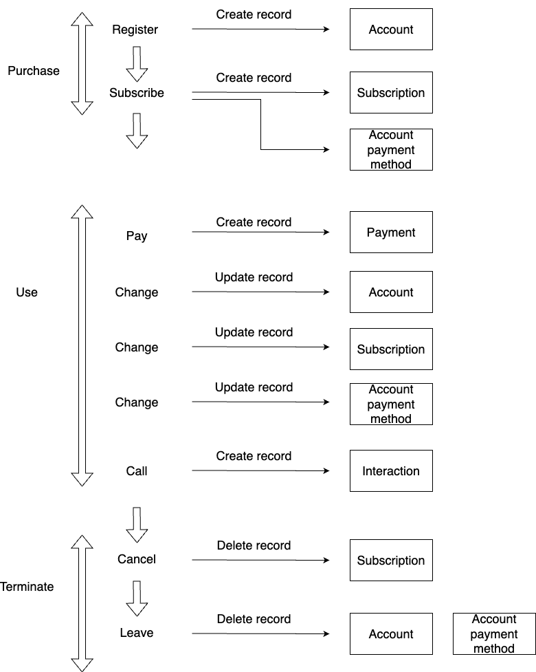
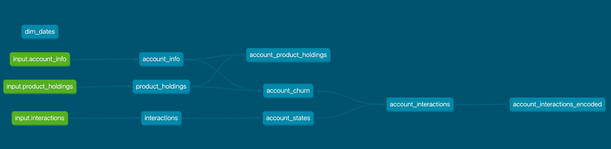

# AwesomeTel Case Study

- This is a case study of a hypothetical telecom provider, "AwesomeTel."
- The purpose of the datamart is to perform general customer analytics and churn modelling.
- The case study includes the design and implementation of the ETL pipeline.
- Building the churn model itself is out of scope.

## Source data mode

Firstly, the following simple customer journey is assumed in this case study.



1. When the Customer registers, a new record is created in the Account entity.
2. The Customer purchases a subscription, which creates a new record in the Subscription and Account payment method entities, respectively.
3. As the Customer makes a payment, a new record is created in the Payment entity.
4. When the Customer updates some information, the corresponding records in the Account, Subscription or Account payment method entities are updated (depending on which information is updated).
5. If the Customer calls the customer services department, a new record is created in the Interaction entity.
6. When the Customer terminates the service, the corresponding records are deleted in the Subscription, Account and Account payment method entity.

Based on the customer journey above, the entity relationship would be as follows:


## Mart design

We can transform the operational entities (tables) into a datamart for analytical purposes.
In this case study, the following assumption is made:

- The payment entity is excluded.
- Each account has only one payment method.
- We can denormalise the Subscription - Product relationship.

We also rename the entities for practical reasons.

- Subscription -> `product_holdings`.
- Account -> `account_info`.
- Interaction -> `interactions`

The details are in the following section.


## Source data analysis

Before implementing the ETL pipeline, it is crucial to analyse the source data.

In this case study, the analysis is done using the Jupyter Notebook [source_data_analysis.ipynb](./notebooks/source_data_analysis.ipynb).

The analysis shows the following characteristics:

- `input.account_info`

  - `account_id` is a unique column.
  - `language` has 4 unique values (`DE`, `EN`, `FR`, `IT`)
  - `language` values are mixed case -> Convert to upper case.
  - `gender` has 3 unique values (`D`, `F`, `M`) -> Convert to upper case
  - `birthday` has values older than 1900. -> Remove
  - `birthday` has values newer than 2008 (i.e. younger than 16). -> Keep
  - no future `birthday` values.
  - The `zip_code` range is between 1000 and 9999 (Switzerland).
  - `payment_method` has 3 unique values (`Kreditkarte`, `LSV`, `Rechnung`).

- `input.product_holdings`

  - `product_family` has 4 unique values.
  - `product_name` has 12 unique values.
  - `prduct_price` is between `0.0` and `49.0` (`product_price = 0.0` -> Fixline, Metered).
  - 437 records have `valid_to` < `valid_from`. -> Remove
  - 137 records have duplicates. -> Deduplicate
  - All `account_id` values exist in `input.account_info`.

- `input.interactions`
  - The value range of the `date` column is between `2021-01-04` and `2026-05-26` (Future interactions exist). -> Remove future interactions
  - The value range of the `time_in_queue` column is between `3` and `90`.
  - The value range of the `handling_time_s` column between `11` and `186`.
  - `call_reason` has 4 unique values (`Billing`, `Churn`, `Product`, `Technical`) and `NULL`.
  - `customer_satisfaction_after_call` has 5 unique values (`1.0`, `2.0`, `3.0`, `4.0`, `5.0`) and `NULL`.
  - All `account_id` values exist in `input.account_info`.

## ETL design

In this case study, ETL is performed using dbt (https://www.getdbt.com/).

dbt is an SQL-based data modelling tool. It has useful built-in features such as testing and documentation and is widely adopted as part of the "modern data stack".

The dbt models are created in the [/dbt/AwesomeTel/](./dbt/AwesomeTel/) directory. The lineage is as follows:



### dbt model implementation

#### [account_info](./dbt/AwesomeTel/models/marts/account_info.sql)

The data type has been cast on the following columns:

- account_id
- birthday
- zipcode

The following columns have been converted to the upper case:

- language
- gender

The following derived column has been added:

- age

The following filters have been added to remove erroneous records:

- `birthday > 1900-01-01`
- `zipcode between 1000 and 9999`

#### [product_holdings](./dbt/AwesomeTel/models/marts/product_holdings.sql)

The data type has been cast on the following columns:

- account_id
- subscription_id
- product_price
- valid_from
- valid_to

The following filters have been added to remove erroneous records:

- `valid_from < valid_to`

#### [interactions](./dbt/AwesomeTel/models/marts/interactions.sql)

The data type has been cast on the following columns:

- account_id
- date
- time_in_queue
- handling_time_s

The following filters have been added to remove erroneous records:

- `time_in_queue > 0`
- `handling_time_s > 0`
- `date <= current_date`

#### [account_product_holdings](./dbt/AwesomeTel/models/marts/account_product_holdings.sql)

Left outer join is performed between the following models:

- account_info
- product_holding

The following derived column has been added:

- tenure
- is_churned
- churned_date

#### [account_states](./dbt/AwesomeTel/models/marts/account_states.sql)

This model assumes that the customer’s state is determined by the `customer_satisfaction_after_call` value between the `call_date` and `next_call_date`.

The following derived column has been added:

- next_call_date
- satisfaction_billing
- satisfaction_churn
- satisfaction_product
- satisfaction_technical

#### [account_churn](./dbt/AwesomeTel/models/marts/account_churn.sql)

This model joins `account_info` with the Customer's first purchase date and last terminate date (which is defined as "churn date") of all products from `product_holdings`.

#### [account_interactions](./dbt/AwesomeTel/models/marts/account_product_interactions.sql)

This model joins the `account_churn` model with the Customer's state 1 month before the `churned_date` taken from the `account_states` model.

#### [account_interactions_encoded](./dbt/AwesomeTel/models/marts/account_product_interactions_encoded.sql)

This model creates one-hot encoding of the categorical fields from the `account_interactions` model.

#### [dim_dates](./dbt/AwesomeTel/models/marts/dim_dates.sql)

Standard date dimension table for reporting purposes. It uses the macro `dbt_date.get_date_dimension` provided by dbt.

### dbt operation

We can run the dbt models by running the following command:

```
$ cd dbt/AwesomeTel
$ dbt run
```

### dbt test

A small number of simple data validations, such as unique, not null, accepted values and relationships, have been implemented as dbt tests in [sources.yml](./dbt/AwesomeTel/models/sources.yml) (source data) and [schema.yml](./dbt/AwesomeTel/models/marts/schema.yml) (marts data).

The following command can run the test:

```
$ dbt test
```

## Marts data analysis

It has been checked that there are no outliners in the mart data using the Jupyter notebook [marts_data_analysis.ipynb](./notebooks/marts_data_analysis.ipynb). Some of the examples are shown below.

### `time_in_queue` distribution

```
SELECT time_in_queue,
       count(*) as count
  FROM marts.interactions
 GROUP BY time_in_queue
 ORDER BY time_in_queue
```


### `handling_time_s` distribution

```
SELECT handling_time_s,
       count(*) as count
  FROM marts.interactions
 GROUP BY handling_time_s
 ORDER BY handling_time_s
```


### `call_reason` values

```
SELECT call_reason,
       count(*) as count
  FROM marts.interactions
 WHERE call_reason IS NOT NULL
 GROUP BY call_reason
 ORDER BY call_reason
```

| call_reason | count |
| ----------- | ----- |
| Billing     | 4621  |
| Churn       | 1325  |
| Product     | 2420  |
| Technical   | 3607  |

### `customer_satisfaction_after_call` values

```
SELECT customer_satisfaction_after_call,
       count(*) as count
  FROM marts.interactions
 WHERE customer_satisfaction_after_call IS NOT NULL
 GROUP BY customer_satisfaction_after_call
 ORDER BY customer_satisfaction_after_call
```

| customer_satisfaction_after_call | count |
| -------------------------------- | ----- |
| 1.0                              | 655   |
| 2.0                              | 1222  |
| 3.0                              | 1208  |
| 4.0                              | 1835  |
| 5.0                              | 2433  |

## Trend analysis

Based on the marts data, we can perform some trend analysis.

### Active accounts by month

```
WITH months as (
    SELECT DISTINCT
           d.month_start_date
      FROM marts.dim_dates d
)
SELECT m.month_start_date as month,
       ph.product_family,
       ph.product_name,
       count(distinct ph.account_id) as number_of_accounts
  FROM months m
  JOIN marts.account_product_holdings ph
    ON m.month_start_date
       between ph.valid_from::date and ph.valid_to::date
 GROUP BY m.month_start_date,
       ph.product_family,
       ph.product_name
 ORDER BY m.month_start_date
```


### Average tenure by month

```
WITH months as (
    SELECT DISTINCT
           d.month_start_date
      FROM marts.dim_dates d
)
SELECT m.month_start_date as month,
       ph.product_family,
       ph.product_name,
       avg(m.month_start_date - ph.valid_from) as avg_tenure
  FROM months m
  JOIN marts.account_product_holdings ph
    ON m.month_start_date
       between ph.valid_from::date and ph.valid_to::date
 GROUP BY m.month_start_date,
       ph.product_family,
       ph.product_name
 ORDER BY m.month_start_date
```


### New accounts by month

```
WITH months as (
    SELECT DISTINCT
           d.month_start_date
      FROM marts.dim_dates d
)
SELECT m.month_start_date as month,
       ph.product_family,
       ph.product_name,
       count(distinct ph.account_id) as number_of_new_accounts
  FROM months m
  JOIN marts.account_product_holdings ph
    ON ph.valid_from::date between m.month_start_date and m.month_start_date + interval '1 month'
 GROUP BY m.month_start_date,
       ph.product_family,
       ph.product_name
 ORDER BY m.month_start_date
```


### Closed accounts by month

```
WITH months as (
    SELECT DISTINCT
           d.month_start_date
      FROM marts.dim_dates d
)
SELECT m.month_start_date as month,
       ph.product_family,
       ph.product_name,
       count(distinct ph.account_id) as number_of_closed_accounts
  FROM months m
  JOIN marts.account_product_holdings ph
    ON ph.valid_to::date between m.month_start_date and m.month_start_date + interval '1 month'
 GROUP BY m.month_start_date,
       ph.product_family,
       ph.product_name
 ORDER BY m.month_start_date
```


## Churn analysis

The following calculates the pairwise correlation of columns in `marts.account_interactions_encoded`. The details are in the Jupyter notebook [churn_analysis.ipynb](./notebooks/churn_analysis.ipynb).

The result suggests that the `has_call` column has the highest correlation with `is_churned`.

A closer look shows that the customers who stayed did not have a call one month before churn. Excluding the call-related columns, shorter tenure and younger age increase the churn rate.

```
is_churned                            1.000000
has_call                              0.365564
call_reason_churn                     0.347343
handling_time_s_0_40                  0.347100
handling_time_s_80                    0.345193
time_in_queue_20_40                   0.343491
time_in_queue_40                      0.343481
time_in_queue_0_20                    0.342417
handling_time_s_40_80                 0.342391
call_reason_product                   0.340353
call_reason_billing                   0.338720
call_reason_technical                 0.338402
customer_satisfaction_after_call_1    0.267262
customer_satisfaction_after_call_3    0.264667
customer_satisfaction_after_call_2    0.263478
customer_satisfaction_after_call_4    0.261415
customer_satisfaction_after_call_5    0.260886
tenure_0_100                          0.136708
tenure_100_200                        0.123117
age_0_25                              0.034084
age_25_50                             0.029260
gender_d                              0.013984
tenure_300_400                        0.012177
tenure_200_300                        0.011844
gender_m                              0.007866
language_de                           0.007698
language_it                          -0.002137
language_fr                          -0.003974
language_en                          -0.013527
gender_f                             -0.013919
age_50_75                            -0.030090
age_75                               -0.055471
tenure_400                           -0.129077
```

|                | has_call (0) | has_call (1) |
| -------------- | ------------ | ------------ |
| is_churned (0) | 12612        | 0            |
| is_churned (1) | 8732         | 2552         |

# Conclusion

In this case study, a customer datamart was designed and implemented based on the given data sources.

The ETL pipeline was implemented using dbt, which performed the transformation, test and documentation of the data pipeline.

The datamart was structured to enable quick analysis on the summary statistics over time and the customer features correlate with churn. Some of the example queries and the results are presented in the case study.
